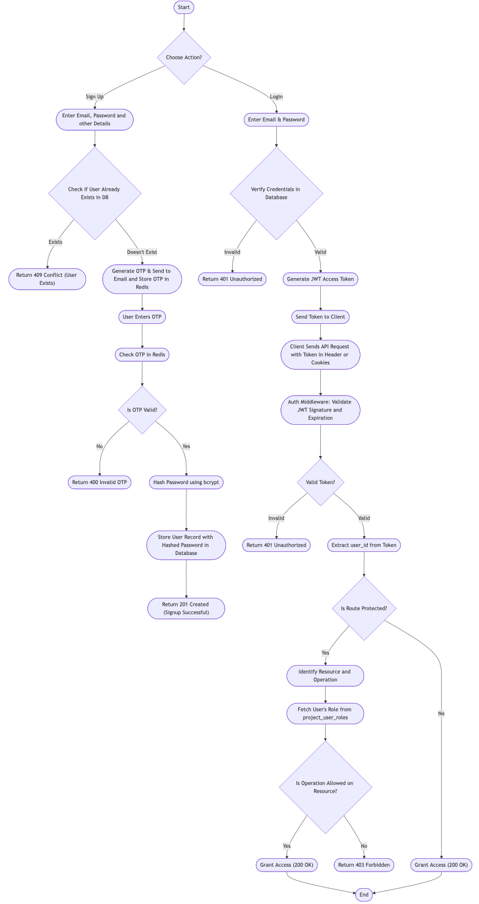

# Data Flow Diagram
The Data Flow Diagram (DFD) for the Colearn platform illustrates the flow of information between various components of the system. It provides a visual representation of how data is processed and transferred within the platform.

## Authentication and Authorization Flow

