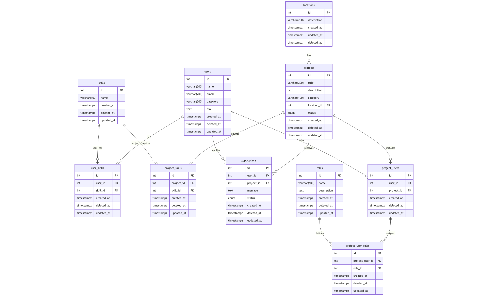

# Entity Relationship Diagram
The Entity Relationship Diagram (ERD) for the Colearn platform depicts the data model and relationships between different entities within the system. It provides a visual representation of how data is structured and interconnected in the platform.

