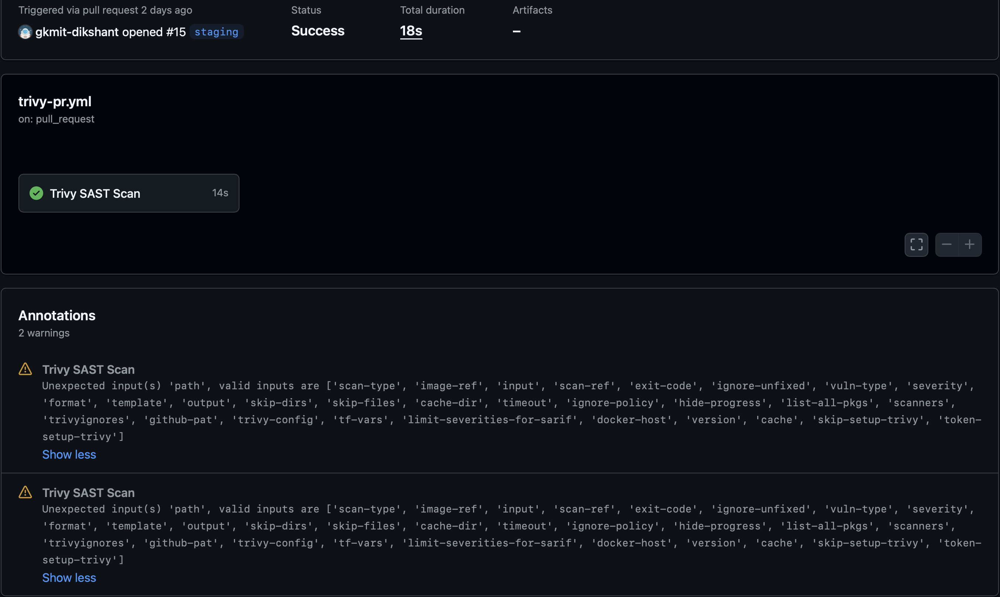
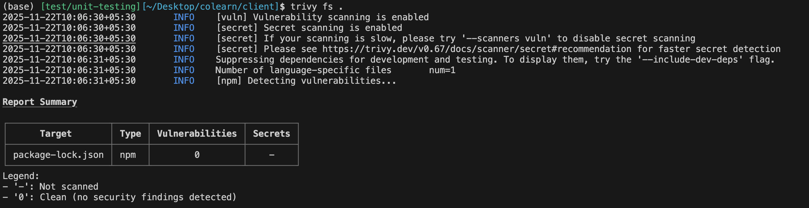

# SAST Scan
This document describes the Static Application Security Testing (SAST) scan process integrated into the CI/CD pipeline using Trivy.
## Overview
The SAST scan is performed on every Pull Request (PR) to the `staging` and `dev` branches. The scan checks for:
- Secrets committed to the repository
- Misconfigured files
- Critical and High severity vulnerabilities
If any issues are detected, the PR cannot be merged until they are resolved.
## Trivy Configuration
Trivy is configured with the following settings:
- **Severity Levels**: Only Critical and High severity issues are reported.
- **Ignore Policy**: A predefined ignore policy is applied to filter out known false positives.
- **Scan Scope**: The scan covers the entire codebase, including dependencies.
## Integration with CI/CD
The SAST scan is integrated into the CI/CD pipeline as follows:
1. **Trigger**: The scan is triggered automatically on PR creation or updates to the `staging` and `dev` branches.
2. **Execution**: Trivy runs the scan and generates a report.
3. **Reporting**: If issues are found, the PR is marked as failed, and detailed reports are provided to the developers for remediation.
4. **Blocking Merges**: PRs with unresolved issues cannot be merged until all critical and high severity vulnerabilities are addressed.
## Remediation Process
When vulnerabilities are detected:
1. Developers receive a notification with the scan report.
2. They must investigate and fix the reported issues.
3. After fixes are applied, the PR is updated, triggering a new SAST scan.
4. Once the scan passes without critical or high severity issues, the PR can be merged.

## Screenshots

## Conclusion
Integrating Trivy SAST scans into the CI/CD pipeline enhances the security posture of the codebase by ensuring that vulnerabilities are identified and addressed early in the development process.